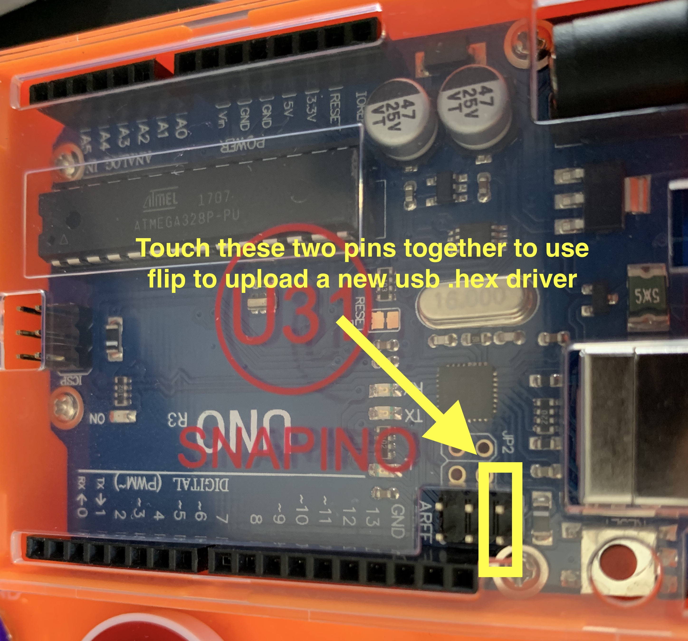

# arduino-lufa-keyboard-mouse
Arduino KeyBoard and Mouse drivers

This is Vlad Cazan's Arduino keyboard driver.
As well as a mouse driver from Anh Nguyen.
Both were linked with LUFA version 100807. So that is included as well.

 * http://vladcazan.com/electronics/arduino-keyboard-emulator
 * http://fourwalledcubicle.com/LUFA.php (version 100807)
 * https://anhnguyen.me/2014/01/turn-arduino-uno-r3-into-a-mouse/

You need Arduino-usbserial-uno.hex flashed onto your Uno in order to use the Arduino programmer to upload new sketches.
You need Arduino-keyboard.hex flashed onto your Uno in order for the Uno to appear and behave as a mouse.

Procedure to update:
1. Touch the two pins together on your Uno to put it in dfu mode 

2. Flash the Arduino-usbserial-uno.hex with a [dfu-programmer] (https://sourceforge.net/projects/dfu-programmer/files/dfu-programmer/) or [flip] (https://www.microchip.com/developmenttools/ProductDetails/PartNo/flip#additional-summary) 
3. Unplug and replugin the Uno.
4. Then you can upload your sketch to your Uno using Arduino.
5. Unplug and replugin the Uno.
6. Touch the two pins together on your Uno to put it in dfu mode 
7. Flash the Arduino-keyboard.hex with a [dfu-programmer] (https://sourceforge.net/projects/dfu-programmer/files/dfu-programmer/) or [flip] (https://www.microchip.com/developmenttools/ProductDetails/PartNo/flip#additional-summary) 


Arduino-usbserial-uno.hex is used to revert the arduino uno back into usb serial mode (original factory mode) so you can upload sketches to the unit.


I wanted to create a fake keyboard that could be programmed to type essentially continusouly while attached. But I wanted it to appear as a USB HID device that spoofs a popular keyboard, rather than identifying as an Arduino keyboard.
You can find a product to spoof, on your mac, by running this command:
```
system_profiler SPUSBDataType
Apple External Keyboard :

          Product ID: 0x0340
          Vendor ID: 0x05ac (Apple Inc.)
          Version: 2.73
          Serial Number: XXXXXXXXXXXXXXXXXX+XXX
          Speed: Up to 480 Mb/s
          Manufacturer: Apple Inc.
          Location ID: 0x80500000 / 3
          Current Available (mA): 500
          Current Required (mA): 500
          Extra Operating Current (mA): 0
          Built-In: Yes
```
You can take that Product ID, Vendor ID and the identification string, "Apple External Keyboard" and replace those lines here:
https://github.com/worldjoe/arduino-lufa-keyboard-mouse/blob/main/Projects/arduino-keyboard-0.3/Descriptors.c#L98
https://github.com/worldjoe/arduino-lufa-keyboard-mouse/blob/main/Projects/arduino-keyboard-0.3/Descriptors.c#L186:#L188

You can also lookup Vendor ID / Product IDs here: https://www.the-sz.com/products/usbid/index.php
That site also has information on how to gather the IDs from a windows pc.
