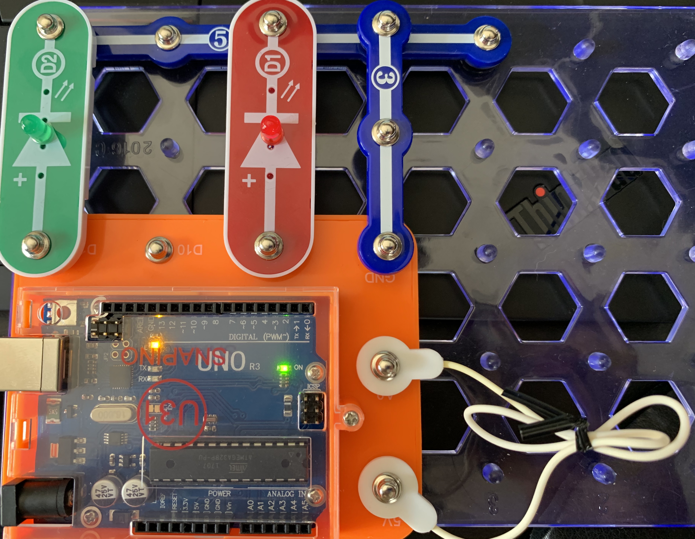

This is the Arduino program that presses random alphanumeric keys (as well as the return character).

You need to build the following Arduino circuit:

The only hard requirement is 5V must be connected to A0. When they are connected the program will press random keys. When they are disconnected the program will pause.
The lights are optional to let me know what the status is from across the room.
